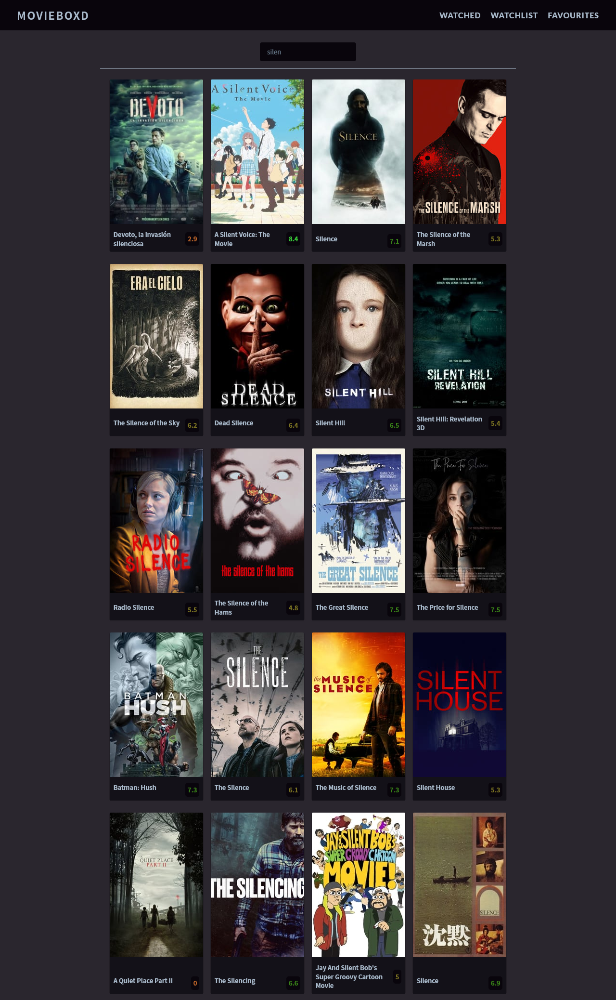
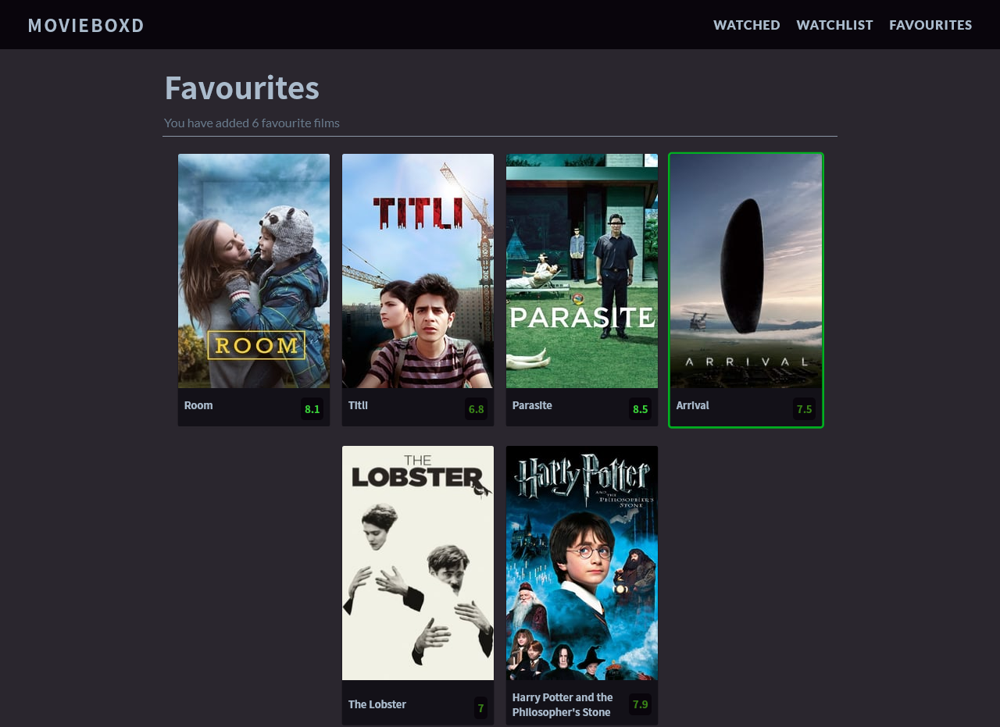
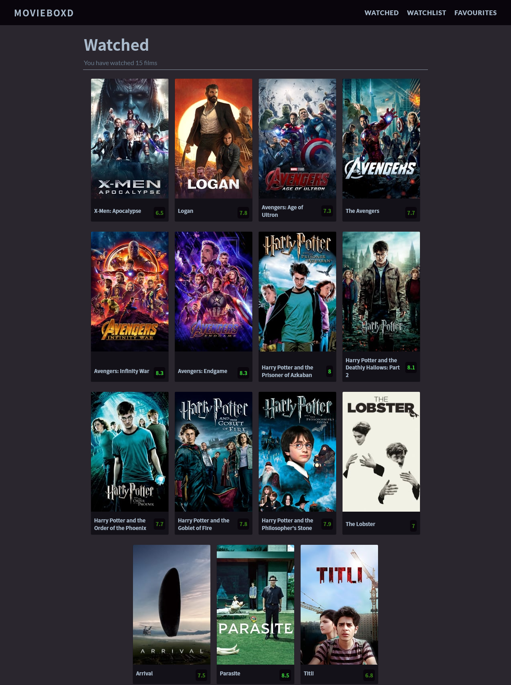
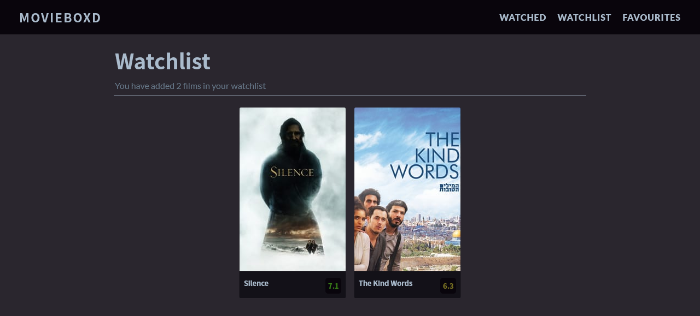

# MOVIEBOXD

A React app to search movies and save them in your 'favourites', 'watched' or 'watchlist'.

It uses TMBD API to search movies.  
Saves them in local storage.   
And uses Context API and Reducers to manage state. 

### Deployed on Netlify

https://movieboxd.netlify.app/

*Homepage*

*Favourites*

*Watched*

*Watchlist*

---
